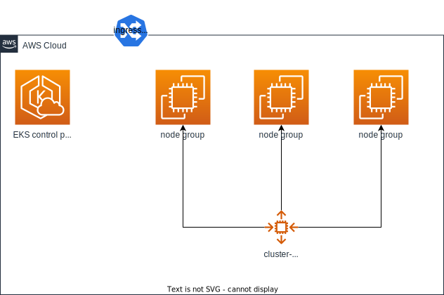
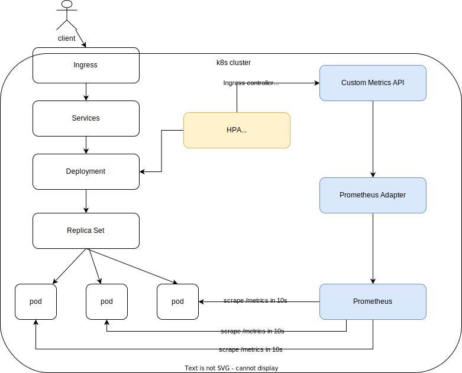

### Requirements
- Another repo create the following resrouce for this project
	- s3 bucket: tfstate-demo-workshop
	- dynamoDB: tfstate-demo-state-backend
	- kms key: alias/tfstate-demo-default
- helm diff plugin: helm plugin install https://github.com/databus23/helm-diff
- Add A record to `ing.mhlien.de`

## This task includes two parts. First, using `terraform` to deploy EKS and cluster-autoscaler, Second using `helmfile` to deploy a sample web-app with HPA.

## Part 1.
### Terraform deploy EKS and helm deploy cluster-autoscaler

```bash
infra/
├── backend.tf
├── charts.tf
├── locals.tf
├── main.tf
├── outputs.tf
├── variables.tf
└── versions.tf

terraform -chdir=infra/ apply
```
### Dump EKS context into localhost
```bash
aws eks --region eu-central-1 update-kubeconfig --name task16-task16
```

## Part 2.
### Deploy HPA trigger by customer metrics via prometheus adapter (within k3d)
#### Helm deploys cert-manager, web-app and prometheus and its adapter by default. In this task, we can access `https://ing.mhlien.tw` from internet. If the request is higher than 80 query per second, then HPA will bring up one new pod.

```bash
## web-app helm chart
charts/
└── web-app
    ├── Chart.yaml
    ├── charts
    ├── templates
    │   ├── NOTES.txt
    │   ├── _helpers.tpl
    │   ├── deployment.yaml
    │   ├── hpa.yaml
    │   ├── ingress.yaml
    │   ├── service.yaml
    │   ├── serviceaccount.yaml
    │   └── tests
    │       └── test-connection.yaml
    └── values.yaml

## external helm chart
services/
├── 10-cert-manager
│   ├── helmfile.yaml
│   └── values.yaml
├── 10-ingress
│   ├── helmfile.yaml
│   └── values.yaml
├── 20-prometheus
│   ├── adapter-values.yaml
│   ├── helmfile.yaml
│   └── values.yaml
├── 30-app
│   ├── helmfile.yaml
│   └── values.yaml
└── base.yaml

helmfile apply
```
#### After helm deploy, you can rely on `custom metrics endpoint` to check it metrics
```bash
## check custom metrics endpoint with kubectl
kubectl get --raw "/apis/custom.metrics.k8s.io/v1beta1/namespaces/web-app/ingresses.networking.k8s.io/web-app/nginx_ingress_controller_requests_rate"|jq .
{
  "kind": "MetricValueList",
  "apiVersion": "custom.metrics.k8s.io/v1beta1",
  "metadata": {
    "selfLink": "/apis/custom.metrics.k8s.io/v1beta1/namespaces/web-app/ingresses.networking.k8s.io/web-app/nginx_ingress_controller_requests_rate"
  },
  "items": [
    {
      "describedObject": {
        "kind": "Ingress",
        "namespace": "web-app",
        "name": "web-app",
        "apiVersion": "networking.k8s.io/v1"
      },
      "metricName": "nginx_ingress_controller_requests_rate",
      "timestamp": "2022-05-23T18:57:26Z",
      "value": "0",
      "selector": null
    }
  ]
}
```
[demo in asciinema](https://asciinema.org/a/JwIcHOZdaOz4LXyKsMxNaRJaF)

### Terraform reference
- [aws_autoscaling_group.instance_refresh](https://registry.terraform.io/providers/hashicorp/aws/latest/docs/resources/autoscaling_group#instance_refresh)

### TODO
- Install `external-dns` to setup ALB in route53
- Setup atlantis to deploy infrastructure, EKS
- Setup argoCD to deploy and sync application with helm chart
