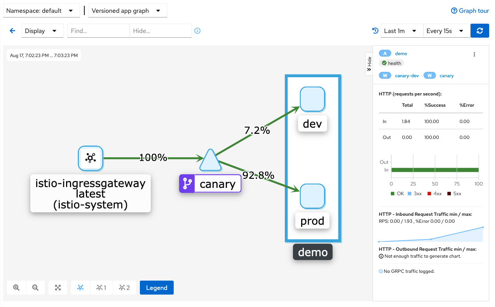
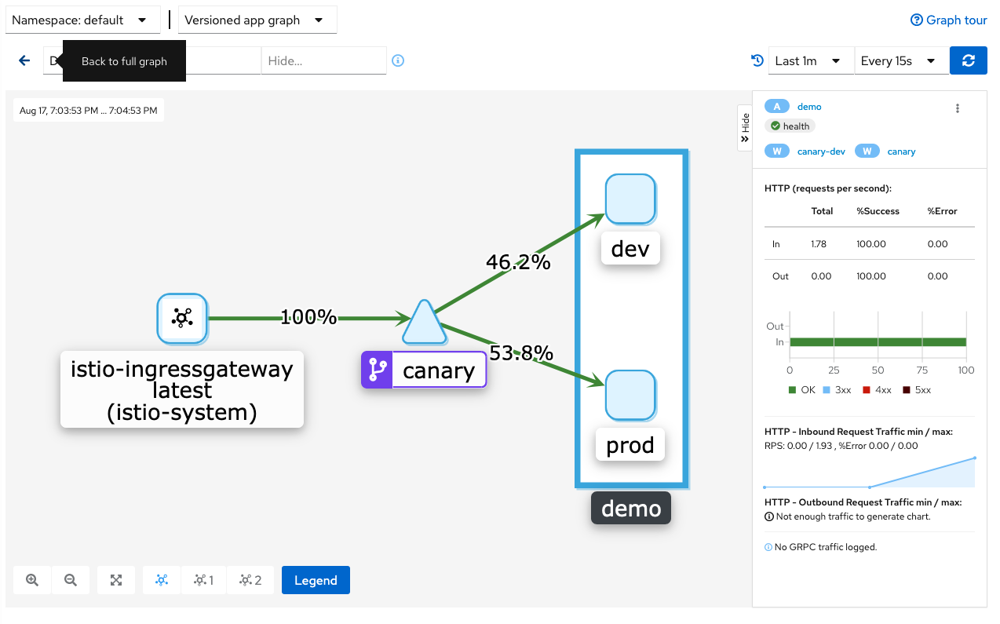

# Canary deploy with istio and minikube
---

### This task is run `kubectl apply` by serial number order.
```bash
kubectl apply -f 1-istio-init.yaml
kubectl apply -f 2-istio-minikube.yaml
...
```

### Since this demo is based on minikube, we have to switch ingress gateway from LoadBalancer to NodePort by following command
```bash
kubectl edit svc istio-ingressgateway -n istio-system
```


### expose nodePort of ingress gateway and minikube ip
```bash
export INGRESS_PORT=$(kubectl -n istio-system get service istio-ingressgateway -o jsonpath='{.spec.ports[?(@.name=="http2")].nodePort}')
export INGRESS_HOST=$(minikube ip)
```

### gather the app's version by curl
```bash
while curl http://$INGRESS_HOST:$INGRESS_PORT/ -HHost:demo.local; sleep 0.5; end
```
#Demo on kiali
### prod:dev = 9:1

### prod:dev = 1:1



[Record]()
